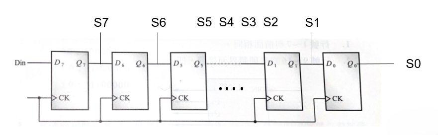

# Lab 05 - 組合邏輯電路

## 實驗目標

使用VHDL語言完成指定電路圖中的組合邏輯電路設計

## 電路描述

本實驗需要實作電路圖中所示的組合邏輯電路，包含：

- 多個邏輯閘的組合
- 輸入信號的邏輯運算  
- 組合邏輯輸出



## 設計步驟

1. **電路分析**
   - 分析電路圖中的邏輯閘類型和連接方式
   - 確定輸入輸出信號的關係

2. **VHDL 設計**
   - 建立 entity 和 architecture
   - 定義輸入輸出埠 
   - 實作組合邏輯功能

3. **模擬驗證**
   - 建立 testbench 測試電路
   - 驗證所有可能的輸入組合

## 輸入輸出規格

根據電路圖確定：

- **輸入**: 根據電路圖定義
- **輸出**: 根據電路圖定義
- **邏輯關係**: 依照電路圖的邏輯閘連接

## 檔案結構

```
lab05/
├── README.md          # 本說明文件
├── circuit.png        # 電路圖
├── *.vhd             # VHDL 源碼檔案
├── *.qpf             # Quartus 專案檔
└── simulation/       # 模擬檔案
    └── *_tb.vhd      # Testbench 檔案
```

## 使用說明

1. **檢視電路圖**: 仔細分析 `circuit.png` 中的電路設計
2. **開啟專案**: 使用 Quartus Prime 開啟專案檔
3. **檢視實作**: 檢查 VHDL 程式碼實作
4. **執行模擬**: 使用 ModelSim 執行 testbench
5. **驗證功能**: 確認輸出結果符合電路圖預期

## 學習重點

- 從電路圖轉換為 VHDL 程式碼
- 組合邏輯電路的設計方法
- VHDL 中邏輯運算子的使用
- 測試向量的設計與驗證

## 設計驗證

- 真值表驗證
- 時序模擬
- 功能正確性檢查
- 延遲特性分析