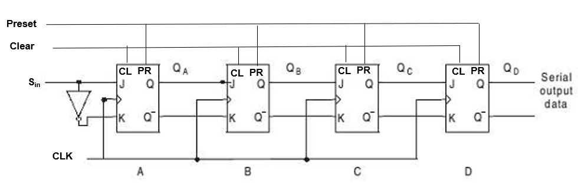

# Lab 05 Bonus - 進階組合邏輯電路 / Advanced Combinational Logic Circuit

## 實驗目標 / Objective

使用VHDL語言完成複雜組合邏輯電路的設計與實作

Complete the design and implementation of complex combinational logic circuit using VHDL

## 電路描述 / Circuit Description

本加分實驗需要實作更複雜的組合邏輯電路，包含：

This bonus lab requires implementing more complex combinational logic circuits, including:

- 多層邏輯閘組合 / Multi-level logic gate combinations
- 複雜的布林邏輯運算 / Complex Boolean logic operations
- 進階電路設計技巧 / Advanced circuit design techniques



## 設計挑戰 / Design Challenges

1. **電路複雜度 / Circuit Complexity**
   - 更多的輸入輸出信號
   - 複雜的邏輯關係
   - More input/output signals
   - Complex logical relationships

2. **最佳化設計 / Optimization Design**
   - 邏輯簡化 / Logic simplification
   - 資源使用最佳化 / Resource usage optimization
   - 延遲時間最小化 / Delay minimization

3. **驗證完整性 / Verification Completeness**
   - 全面的測試案例 / Comprehensive test cases
   - 邊界條件測試 / Boundary condition testing
   - 錯誤檢測機制 / Error detection mechanisms

## 設計方法 / Design Methodology

### 1. 分析階段 / Analysis Phase
- 詳細分析電路圖規格
- 確定關鍵路徑和時序要求
- Detailed analysis of circuit diagram specifications
- Identify critical paths and timing requirements

### 2. 設計階段 / Design Phase  
- 模組化設計方法
- 階層化架構規劃
- Modular design approach
- Hierarchical architecture planning

### 3. 實作階段 / Implementation Phase
- VHDL 程式碼撰寫
- 語法檢查和邏輯驗證
- VHDL code development
- Syntax checking and logic verification

### 4. 測試階段 / Testing Phase
- 完整的 testbench 設計
- 多種測試情境驗證
- Comprehensive testbench design
- Multiple test scenario verification

## 檔案結構 / File Structure

```
lab05_bonus/
├── README.md          # 本說明文件 / This README
├── circuit.png        # 電路圖 / Circuit diagram
├── *.vhd             # VHDL 源碼檔案 / VHDL source files
├── *.qpf             # Quartus 專案檔 / Quartus project file
├── simulation/       # 模擬檔案 / Simulation files
│   ├── *_tb.vhd      # Testbench 檔案
│   └── wave.do       # ModelSim 波形設定
└── docs/             # 說明文件 / Documentation
    └── analysis.pdf  # 設計分析報告
```

## 進階技術要點 / Advanced Technical Points

- **邏輯最佳化 / Logic Optimization**: 使用 Karnaugh Map 或 Boolean algebra 簡化邏輯
- **時序分析 / Timing Analysis**: 計算關鍵路徑延遲
- **功耗評估 / Power Estimation**: 分析電路功耗特性
- **可測試性設計 / Design for Testability**: 加入測試輔助功能

## 評估標準 / Evaluation Criteria

1. **功能正確性 / Functional Correctness** (40%)
2. **設計品質 / Design Quality** (30%)
3. **測試完整性 / Test Completeness** (20%)
4. **文件品質 / Documentation Quality** (10%)

## 學習成果 / Learning Outcomes

完成本實驗後，學生應能夠：

Upon completion of this lab, students should be able to:

- 設計複雜的組合邏輯電路
- 應用邏輯最佳化技術
- 撰寫高品質的 VHDL 程式碼
- 建立完整的測試驗證流程
- Design complex combinational logic circuits
- Apply logic optimization techniques
- Write high-quality VHDL code
- Establish complete test verification procedures