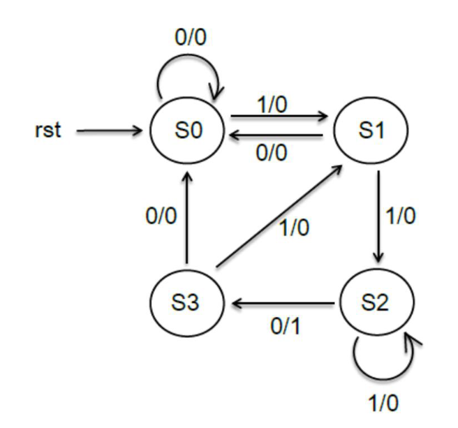

使用VHDL 製作Sequence Detector FSM
- Implement a sequence detector that can search the string “110” using VHDL
- str_in (serial input) ; str_out (parallel output)
- e.g. str_out : 100 ; match : 0
	str_out : 110 ; match : 1
	
